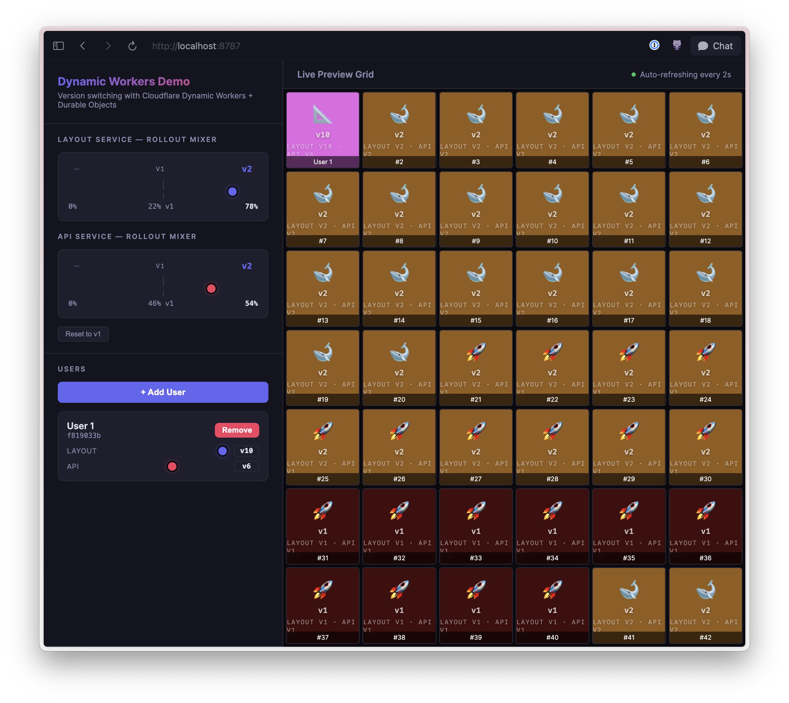

# Dynamic Workers Rollout Demo

Interactive demo of [Cloudflare Dynamic Workers](https://developers.cloudflare.com/dynamic-workers/) for progressive version rollouts.



## Why Dynamic Workers are a big deal

Traditional deployments are all-or-nothing. You build, deploy, and hope. Feature flags add complexity. Canary deploys require infrastructure. Blue-green needs duplicate environments.

[Dynamic Workers](https://developers.cloudflare.com/dynamic-workers/getting-started/) flip this: your gateway stays deployed, and sub-services are loaded on-demand from storage via [`env.LOADER.get()`](https://developers.cloudflare.com/dynamic-workers/getting-started/#reusing-a-dynamic-worker-across-requests). Change the version ID, get different code. No redeploy. No restart. No downtime.

This means you can:

- **Deploy a PR** by writing its compiled worker to KV and routing a % of traffic to it
- **Roll out gradually** using consistent hashing — same user always gets the same version at a given balance, no flickering
- **Pin a specific user** to a version for targeted testing in production
- **Roll back instantly** by changing which version ID the gateway requests
- **Version sub-services independently** — update the API without touching the layout, or vice versa

The deploy pipeline becomes: write code to KV, slide a crossfader.

## How this demo works

A gateway worker composes two independently-versioned sub-services (layout + API), each loaded from KV as a Dynamic Worker. A Durable Object stores rollout state. The UI lets you drag crossfader mixers to shift traffic between versions and pin individual users to specific versions.

## Running locally

```sh
npm install
npm run dev
```

Open [http://localhost:8787](http://localhost:8787). Versions auto-seed to KV on first request.
